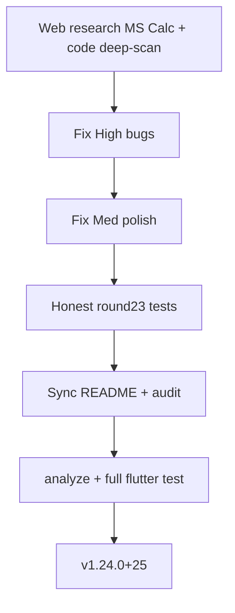

# پولیش نهایی و صحت‌سنجی اتمیک (v1.24)

## مهر تأیید چک نهایی (۱۹ ژوئیه ۲۰۲۶)

بازبینی مجدد گسترده روی کد زنده — **همهٔ ۸ مورد High با شواهد خط تأیید شدند. حفرهٔ High جدید پیدا نشد.**

| ID | ادعا | شواهد کد | وضعیت |
|----|------|----------|--------|
| H1 | paste کاما رد می‌شود | `_allowedChars` بدون `,` در `paste_parser.dart:28,78`؛ `normalizePaste` هرگز برای `,` صدا زده نمی‌شود | تأیید |
| H1b | EU دو جداکننده اشتباه | `digit_locale.dart:46-48` وقتی هم `.` هم `,` دارد، فقط کاما را strip می‌کند → `1.234,56` → `1.23456` | تأیید (در H1 بگنجان) |
| H2 | loadResult تکرار = را نگه می‌دارد | `loadResult` خطوط 119–127: `_lastOp`/`_lastOperand` پاک نمی‌شوند | تأیید |
| H3 | touch lock فقط keypad | `touchEnabled` فقط به `CalcKeypad`؛ display/memory بدون گارد | تأیید |
| H4 | Space≠equals در docs | arb: «Space or Enter = equals»؛ کد: `space` → `_activateKeypadFocus` (خط 654) | تأیید |
| H5 | % روی ×/÷ غلط | `percent()` همیشه `acc*v/100` (خطوط 272–274) | تأیید |
| H6 | FA digits گیر ON | `usePersianDigits => _persianDigits \|\| locale==fa` | تأیید |
| H7 | dispose/_persist | `dispose` خط 90 → `_persist()` سپس خط 112 `widget.settings` بعد از await | تأیید |
| H8 | % بدون catch | `onPercent` خطوط 799–801 بدون try/`_handleCalcError` | تأیید |
| Docs | README «263» | README چند جا 263؛ واقعیت باید از `flutter test` خوانده شود | تأیید drift |

**نتیجه:** پلن کامل و آمادهٔ اجراست. هیچ High اضافه‌ای از این چک بیرون نیامد. Med (MS button، persist toggle فوری، Ctrl+H) اختیاریِ همان دور بعد از High.

---

## نتیجه بازبینی پلن + تحقیق تکمیلی

پلن اولیه ۳ باگ داشت. پس از جستجوی وب (microsoft/calculator #2396, #162, #322, #2392, #264) و اسکن عمیق کد، **حفره‌های High/Med بیشتری** پیدا شد که باید قبل از «کامل بودن» بسته شوند. موارد P2 (scientific، graphing، `package:decimal`) عمداً خارج از این دور می‌مانند.

## وضعیت پایه (از قبل درست)
- هسته Standard: LTR chain، repeat `=`، memory، history persist، FA/EN، RTL chrome، shortcuts dialog، settings dialog،  rounds 5–22
- نسخه فعلی: **1.23.0+24** · بدون TODO واقعی در `lib/`
- l10n EN/FA: parity کلیدها OK

---

## High — باید در این دور رفع شود

### H1) Paste locale / کاما / نقطه (گسترش یافته از پلن قبلی)
**منبع:** MS [#2396](https://github.com/microsoft/calculator/issues/2396)، [#162](https://github.com/microsoft/calculator/issues/162)، رفتار CopyPasteManager ویندوز  
**کد:** [`lib/utils/paste_parser.dart`](lib/utils/paste_parser.dart)، [`lib/utils/digit_locale.dart`](lib/utils/digit_locale.dart)

دو لایهٔ باگ:
1. `paste_parser` قبل از `normalizePaste` با regex بدون `,` رد می‌کند
2. حتی بعد از باز کردن دروازه، `DigitLocale.normalizePaste` برای ورودی دارای **هر دو** `.` و `,` فقط کاما را حذف می‌کند (EU خراب)

قوانین هدف (صادقانه):
- `,` را در allowlist بگذار یا **اول** `normalizePaste` را صدا بزن
- اگر فقط یکی از جداکننده‌ها باشد: آن را اعشار بگیر (EU `3,14` و US `3.14`)
- اگر هر دو باشند: **آخرین** جداکننده = اعشار، بقیه هزارگان (`1.234,56` → `1234.56`؛ `1,234.56` → `1234.56`)
- ارقام فارسی/عربی و `٬` هزارگان فارسی نرمال شوند
- بیش از ۱۶ رقم: trim + اعلان `pasteTrimmed` (قبلاً هست)

تست: `3,14` · `1.234,56` · `1,234.56` · `۱٬۲۳۴` · `0.011`

### H2) History reuse + تکرار `=`
[`lib/calculator.dart`](lib/calculator.dart) `loadResult` باید `_lastOp` / `_lastOperand` را هم null کند.  
تست: `5+3=` → reuse `99` → `=` → نمایش `99` بماند.

### H3) Touch lock ناقص
[`calculator_page.dart`](lib/ui/calculator_page.dart) + [`calc_display_panel.dart`](lib/ui/widgets/calc_display_panel.dart) + [`calc_memory_bar.dart`](lib/ui/widgets/calc_memory_bar.dart):  
لمس display/memory در حالت قفل → hint؛ کیبورد فعال بماند.

### H4) Space ≠ equals (ناهم‌خوانی مستند/کد)
**کد:** Space = activate focused key · Enter = equals  
**ادعای غلط:** `app_*.arb` / README («Space or Enter = equals»)  
اصلاح: متن l10n + README به رفتار واقعی.

### H5) Percent روی ×/÷ ≠ Windows Standard
[`calculator.dart`](lib/calculator.dart) `percent()` الان همیشه `acc * v / 100`.  
Windows: برای `+`/`−` همان؛ برای `×`/`÷` فقط `v/100`.  
مثال: `50 × 10%` → باید `5` (نه `250`). تست در round23.

### H6) سوییچ اعداد فارسی در locale FA گیر کرده ON
[`app_settings.dart`](lib/settings/app_settings.dart): `usePersianDigits = _persianDigits || locale==fa` باعث می‌شود Switch در FA خاموش نشود.  
اصلاح: پیش‌فرض FA = ON، ولی `_persianDigits` قابل OFF مستقل؛ یا جدا کردن «default» از «override».

### H7) `dispose` → `_persist()` race
[`calculator_page.dart`](lib/ui/calculator_page.dart): بعد از await به `widget.settings` دست نزن؛ snapshot prefs را قبل از await بگیر یا fire-and-forget امن.

### H8) % و MR بدون catch خطا
مسیرهای `onPercent` / memory recall مثل `equals` از `_handleCalcError` رد شوند تا overflow crash نکند.

---

## Med — در همین دور اگر زمان کافی (اولویت بعد از High)

| ID | موضوع | اقدام |
|----|--------|--------|
| M1 | دکمه MS روی memory bar | افزودن MS (store) برای parity لمسی با Ctrl+M |
| M2 | `setPersistHistory(false)` فقط prefs می‌نویسد | هنگام toggle، یک `_persist()` فوری از page |
| M3 | History dismiss RTL | تست FA swipe-delete؛ در صورت نیاز `DismissDirection` |
| M4 | Display swipe فقط چپ | در RTL هم «به سمت حذف رقم» (negative در LTR numbers wrapper کافی است — فقط تست کن) |
| M5 | Ctrl+H وقتی side history باز است | no-op یا focus پنل؛ متن shortcut صادقانه |

---

## Low / P2 — خارج از این دور (عمدی)

- Scientific / Programmer / graphing / iOS
- `package:decimal` / golden DPI
- آستانه sci `1e10` vs Windows `~1e16` (فقط مستند کن)
- CE دکمه جدا (long-press C کافی است)
- silent max-digit (snackbar اختیاری آینده)
- Application ID boilerplate Android

---

## تأیید نهایی (بدون تقلب)

1. `flutter analyze` clean  
2. `flutter test` — همه PASS؛ شمارش واقعی در README/audit  
3. [`test/round23_qa_test.dart`](test/round23_qa_test.dart) برای H1–H8 (حداقل یک تست صادقانه per High)  
4. Bump به **1.24.0+25**  
5. به‌روزرسانی [`CALCULATOR-NEEDS-AUDIT-FA.md`](toolchain/docs/CALCULATOR-NEEDS-AUDIT-FA.md) تا v1.24 + ماتریس round23

## فایل‌های اصلی
- [`lib/utils/paste_parser.dart`](lib/utils/paste_parser.dart) · [`lib/utils/digit_locale.dart`](lib/utils/digit_locale.dart)
- [`lib/calculator.dart`](lib/calculator.dart)
- [`lib/settings/app_settings.dart`](lib/settings/app_settings.dart)
- [`lib/ui/calculator_page.dart`](lib/ui/calculator_page.dart)
- [`lib/ui/widgets/calc_display_panel.dart`](lib/ui/widgets/calc_display_panel.dart)
- [`lib/ui/widgets/calc_memory_bar.dart`](lib/ui/widgets/calc_memory_bar.dart)
- [`lib/l10n/app_en.arb`](lib/l10n/app_en.arb) · [`lib/l10n/app_fa.arb`](lib/l10n/app_fa.arb)
- [`README.md`](README.md) · audit FA · `pubspec.yaml` · `test/round23_qa_test.dart`
