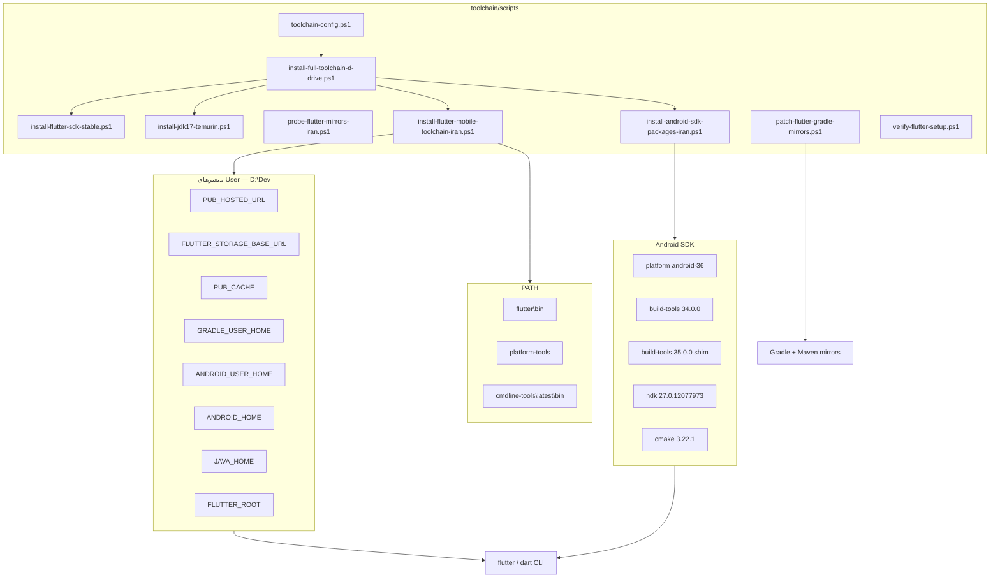

# راهنمای نصب Flutter/Dart toolchain — شبکه ایران

> **این سند:** نصب SDK، env، Android toolchain، Gradle mirrors  
> **راهنمای نقش‌محور (شروع اینجا):** [README-FA.md](README-FA.md)  
> - [Web](GUIDE-WEB-FA.md) · [Windows](GUIDE-WINDOWS-FA.md) · [Mobile/Android](GUIDE-MOBILE-FA.md)

> **مخاطب:** همه توسعه‌دهندگان — بخش Android برای **موبایل** الزامی است؛ Web/Windows فقط Flutter SDK + env  
> **پروژه:** `D:\0\calculator_app\calculator_app` — toolchain در `toolchain/`  
> **نسخه Flutter هدف:** **آخرین stable** (اسکریپت قبل از دانلود از `releases_windows.json` می‌خواند؛ فعلاً ~3.44.x)  
> **مسیر پیش‌فرض toolchain:** `D:\Dev\` (همه‌چیز روی D — نه C)  
> **Android:** minSdk **27** (8.1 Oreo) تا **آخرین نسخه Android** — compileSdk از Flutter stable  
> **آخرین به‌روزرسانی:** ۱۴۰۵/۰۴/۱۲

---

## فهرست

0. [مستندات نقش‌محور (Web / Windows / Mobile)](#مستندات-نقش‌محور-web--windows--mobile)
1. [خلاصه و وضعیت فعلی](#خلاصه-و-وضعیت-فعلی)
2. [معماری toolchain](#معماری-toolchain)
3. [پیش‌نیازها](#پیش‌نیازها)
4. [نصب Flutter SDK (یک‌بار، دستی)](#نصب-flutter-sdk-یک‌بار-دستی)
5. [نصب خودکار toolchain (توصیه‌شده)](#نصب-خودکار-toolchain-توصیه‌شده)
6. [متغیرهای محیطی و PATH](#متغیرهای-محیطی-و-path)
7. [مرجع اسکریپت‌ها و پارامترها](#مرجع-اسکریپت‌ها-و-پارامترها)
8. [Android SDK — بسته‌های لازم](#android-sdk--بسته‌های-لازم)
9. [Android 8.1+ (minSdk 27)](#android-81-minsdk-27)
10. [کار با calculator_app](#کار-با-calculator_app)
11. [اولین پروژه Flutter جدید](#اولین-پروژه-flutter-جدید)
12. [پیکربندی Gradle هر پروژه (APK)](#پیکربندی-gradle-هر-پروژه-apk)
13. [چک نهایی](#چک-نهایی)
14. [تحلیل اتمیک (ماتریس وابستگی)](#تحلیل-اتمیک-ماتریس-وابستگی)
15. [عیب‌یابی](#عیب‌یابی)
16. [آینه‌ها و CDN](#آینه‌ها-و-cdn)
17. [چک‌لیست یک‌صفحه‌ای](#چک‌لیست-یک‌صفحه‌ای)

---

## مستندات نقش‌محور (Web / Windows / Mobile)

| نقش | راهنما | Android SDK لازم؟ |
|-----|--------|-------------------|
| **Web** | [GUIDE-WEB-FA.md](GUIDE-WEB-FA.md) | خیر |
| **Windows** | [GUIDE-WINDOWS-FA.md](GUIDE-WINDOWS-FA.md) | خیر |
| **Mobile** | [GUIDE-MOBILE-FA.md](GUIDE-MOBILE-FA.md) | بله (+ NDK برای APK) |

فهرست کامل: [README-FA.md](README-FA.md)

---

## خلاصه و وضعیت فعلی

| مورد | وضعیت |
|------|--------|
| Flutter SDK | `D:\Dev\flutter` (دانلود خودکار stable) |
| Android SDK | `D:\Dev\Android\Sdk` |
| Java (Temurin 17 LTS) | `D:\Dev\Java\jdk-17` |
| Pub / Gradle / Android user | `D:\Dev\.pub-cache` · `.gradle` · `.android` |
| compileSdk | **پویا** از Flutter stable (فعلاً **36**) |
| minSdk پیشنهادی | **27** (Android 8.1 Oreo+) — تا آخرین Android |
| Pub mirror پیش‌فرض | `https://pub.myket.ir` |
| Storage mirror | `https://storage.flutter-io.cn` |
| نمونه پروژه | `D:\0\calculator_app\calculator_app` |

---

## معماری toolchain



---

## پیش‌نیازها

| نرم‌افزار | مسیر / نسخه | توضیح |
|-----------|-------------|--------|
| **Flutter SDK** | `D:\Dev\flutter` | اسکریپت **آخرین stable** را خودکار دانلود می‌کند |
| **JDK 17 LTS** | `D:\Dev\Java\jdk-17` | Temurin از Adoptium API (stable) |
| **Android Studio** | اختیاری | Emulator و GUI SDK Manager |
| **Visual Studio Build Tools 2022** | `D:\Dev\VS2022BuildTools` | MSVC + CMake + Windows SDK — اسکریپت `install-windows-desktop-toolchain.ps1` |
| **SOCKS proxy** | `127.0.0.1:10808` | برای CDN Google، Gradle wrapper، NDK (در صورت timeout) |
| **PowerShell 5.1+** | پیش‌فرض Windows | اجرای اسکریپت‌ها |
| **فضای دیسک D:** | ~3–4 GB (بدون NDK) · ~5 GB (با NDK) · +~6 GB (VS Build Tools) | پروژه + cache روی **همان درایو D** |

> **مهم:** پروژه (`D:\0\calculator_app\...`)، `PUB_CACHE` و Android SDK باید روی **یک درایو** باشند تا خطای Gradle «different roots» رخ ندهد ([Flutter #105395](https://github.com/flutter/flutter/issues/105395)).

---

## نصب Flutter SDK

### روش A — خودکار (توصیه‌شده، stable پویا)

اسکریپت `install-flutter-sdk-stable.ps1` قبل از دانلود، آخرین نسخه **stable** را از `releases_windows.json` می‌خواند:

```powershell
powershell -ExecutionPolicy Bypass -File toolchain/scripts/install-flutter-sdk-stable.ps1
# مسیر پیش‌فرض: D:\Dev\flutter
```

یا همه‌چیز یک‌جا:

```powershell
cd D:\0\calculator_app\calculator_app
powershell -ExecutionPolicy Bypass -File toolchain/scripts/install-full-toolchain-d-drive.ps1
```

### روش B — دستی (fallback)

اگر دانلود خودکار timeout داد:

1. از [flutter.dev](https://docs.flutter.dev/get-started/install/windows/mobile) یا آینه `storage.flutter-io.cn` فایل ZIP **stable** Windows را بگیرید.
2. Extract در `D:\Dev\flutter` (بدون فاصله در مسیر).
3. سپس اسکریپت env/Android را اجرا کنید (بخش بعد).

---

## نصب خودکار toolchain (توصیه‌شده)

از **ریشه پروژه calculator_app**:

```powershell
cd D:\0\calculator_app\calculator_app

# روش یک‌خطی (JDK + Flutter stable + Android SDK + env + verify)
powershell -ExecutionPolicy Bypass -File toolchain/scripts/install-full-toolchain-d-drive.ps1

# — یا مرحله‌به‌مرحله —

# ۱) پروب آینه‌ها (اختیاری)
powershell -ExecutionPolicy Bypass -File toolchain/scripts/probe-flutter-mirrors-iran.ps1

# ۲) JDK 17 LTS (Temurin stable)
powershell -ExecutionPolicy Bypass -File toolchain/scripts/install-jdk17-temurin.ps1

# ۳) Flutter stable (پویا)
powershell -ExecutionPolicy Bypass -File toolchain/scripts/install-flutter-sdk-stable.ps1

# ۴) نصب env + SDK پایه + Gradle patch
powershell -ExecutionPolicy Bypass -File toolchain/scripts/install-flutter-mobile-toolchain-iran.ps1 -PubMirror iran

# ۵) بسته‌های SDK (compileSdk پویا از Flutter)
powershell -ExecutionPolicy Bypass -File toolchain/scripts/install-android-sdk-packages-iran.ps1

# ۶) Windows desktop — VS Build Tools + CMake + Windows SDK (Admin، ~10–40 دقیقه)
powershell -ExecutionPolicy Bypass -File toolchain/scripts/install-windows-desktop-toolchain.ps1
# فقط موبایل: install-full-toolchain-d-drive.ps1 -SkipWindowsDesktop

# ۷) NDK برای APK release (~745 MB)
powershell -ExecutionPolicy Bypass -File toolchain/scripts/install-android-sdk-packages-iran.ps1 -IncludeNdk

# ۸) چک نهایی
powershell -ExecutionPolicy Bypass -File toolchain/scripts/verify-flutter-setup.ps1 -Strict
```

**PowerShell جدید** باز کنید تا PATH و env اعمال شوند.

---

## متغیرهای محیطی و PATH

### متغیرهای User (الزامی)

| متغیر | مقدار پیش‌فرض (D:) | نقش |
|--------|---------------------|-----|
| `FLUTTER_ROOT` | `D:\Dev\flutter` | مسیر SDK |
| `PUB_HOSTED_URL` | `https://pub.myket.ir` | دانلود پکیج Dart |
| `FLUTTER_STORAGE_BASE_URL` | `https://storage.flutter-io.cn` | engine/artifacts فلاتر |
| `PUB_CACHE` | `D:\Dev\.pub-cache` | cache پکیج‌ها (هم‌درایو با پروژه) |
| `GRADLE_USER_HOME` | `D:\Dev\.gradle` | cache Gradle |
| `ANDROID_USER_HOME` | `D:\Dev\.android` | repositories.cfg |
| `ANDROID_HOME` | `D:\Dev\Android\Sdk` | Android SDK |
| `ANDROID_SDK_ROOT` | همان `ANDROID_HOME` | سازگاری ابزارها |
| `JAVA_HOME` | `D:\Dev\Java\jdk-17` | Gradle / sdkmanager |

### PATH (User) — سه segment

```
D:\Dev\flutter\bin
D:\Dev\Android\Sdk\platform-tools
D:\Dev\Android\Sdk\cmdline-tools\latest\bin
```

### تأیید سریع

```powershell
flutter --version
dart --version
adb version
java -version
```

---

## مرجع اسکریپت‌ها و پارامترها

| اسکریپت | کاربرد | زمان اجرا |
|---------|--------|-----------|
| `install-full-toolchain-d-drive.ps1` | **همه‌چیز یک‌جا:** JDK + Flutter stable + Android + env + verify | اولین نصب روی D: |
| `install-flutter-sdk-stable.ps1` | دانلود/extract آخرین Flutter **stable** (پویا) | قبل از env |
| `install-jdk17-temurin.ps1` | Temurin JDK 17 LTS (Adoptium API) | قبل از Android build |
| `toolchain-config.ps1` | مسیرهای D: + resolve نسخه‌ها (dot-source) | داخلی |
| `probe-flutter-mirrors-iran.ps1` | تست دسترسی آینه Pub/Storage/Maven/Android CDN | قبل از نصب / هنگام قطعی |
| `install-flutter-mobile-toolchain-iran.ps1` | env، PATH، cmdline-tools، platform-tools، licenses، Gradle patch | یک‌بار (یا بعد از فرمت) |
| `install-android-sdk-packages-iran.ps1` | platform-36، build-tools، cmake، NDK (`-IncludeNdk`) | بعد از نصب پایه |
| `patch-flutter-gradle-mirrors.ps1` | پچ Maven در Flutter SDK + `~/.gradle/gradle.properties` | خودکار از نصب؛ یا دستی بعد از آپدیت Flutter |
| `install-windows-desktop-toolchain.ps1` | VS Build Tools + MSVC + CMake + Windows SDK روی D: | برای `flutter build windows` |
| `run-production-builds.ps1` | build واقعی Web + APK + Windows + چک emulator | بعد از نصب کامل |
| `download-resolver.ps1` | منطق دانلود لایه‌ای (official → fallback → iran) | داخلی |
| `tests/Run-ToolchainTests.ps1` | تست parse + منطق نسخه + tier order | CI / دستی |
| `tests/Run-SmokeTests.ps1` | **اسموک صادقانه:** verify + doctor + test + build + artifact | قبل از release |

### سیاست دانلود لایه‌ای (tiered)

هر بار اجرای اسکریپت نصب:

1. **Primary:** سرور رسمی / GitHub / Google (`dl.google.com`, `storage.googleapis.com`, `api.adoptium.net`, Tencent, Aliyun)
2. **Fallback:** آینه منطقه‌ای (`storage.flutter-io.cn`, `redirector.gvt1.com`)
3. **Iran:** آینه ایرانی (`wget.s13est.com`) — فقط بعد از چند تلاش ناموفق
4. **SOCKS** (اختیاری): `127.0.0.1:10808` اگر همه tierها شکست خوردند

**ارتقای خودکار stable:** در هر اجرا، اگر نسخه stable جدیدتر از نصب‌شده باشد، دانلود → جایگزینی → حذف نسخه قدیم (Flutter و JDK).

```powershell
# تست جامع اسکریپت‌ها
powershell -ExecutionPolicy Bypass -File toolchain/tests/Run-ToolchainTests.ps1 -IncludeNetwork -IncludeLiveVerify

# اسموک کامل (صادقانه — verify + doctor + flutter test + build + artifact)
powershell -ExecutionPolicy Bypass -File toolchain/tests/Run-SmokeTests.ps1

# build واقعی پروژه
powershell -ExecutionPolicy Bypass -File toolchain/scripts/run-production-builds.ps1
```

**`install-flutter-mobile-toolchain-iran.ps1`**

| پارامتر | پیش‌فرض | توضیح |
|---------|---------|--------|
| `-PubMirror` | `auto` | `iran` \| `china` \| `official` \| `auto` |
| `-FlutterRoot` | `D:\Dev\flutter` | مسیر SDK |
| `-SkipAndroidSdk` | — | فقط env/PATH/Gradle |
| `-VerifyFlutter` | — | `flutter doctor` با timeout (اختیاری) |

**`install-android-sdk-packages-iran.ps1`**

| پارامتر | پیش‌فرض | توضیح |
|---------|---------|--------|
| `-IncludeNdk` | — | NDK r27 (~745 MB) برای APK release |
| `-SkipBuildTools` / `-SkipPlatform` | — | نصب جزئی (عیب‌یابی) |
| `-ForceRefresh` | — | دانلود مجدد حتی اگر نصب شده |

**`verify-flutter-setup.ps1`**

| پارامتر | توضیح |
|---------|--------|
| `-Strict` | NDK اجباری — قبل از `flutter build apk --release` |
| `-SkipDoctor` | فقط چک‌های اتمیک محلی (سریع‌تر) |

### قالب‌ها (`toolchain/templates/`)

| فایل | کاربرد |
|------|--------|
| `flutter-android-mirrors.snippet.kts` | کپی در `settings.gradle.kts` / `build.gradle.kts` هر پروژه |
| `gradle-user.properties` | نمونه SOCKS برای `%USERPROFILE%\.gradle\` |
| `android-repositories.cfg` | کپی در `%USERPROFILE%\.android\` |

---

## Android SDK — بسته‌های لازم

| مسیر SDK | حجم تقریبی | الزام |
|----------|------------|--------|
| `cmdline-tools/latest` | ~140 MB | بله |
| `platform-tools` | ~2 MB | بله (adb) |
| `platforms/android-36` | ~63 MB | بله (compileSdk 36) |
| `build-tools/34.0.0` | ~56 MB | بله |
| `build-tools/35.0.0` | shim از 34 | بله (برچسب AGP 8.11) |
| `cmake/3.22.1` | ~16 MB | بله (APK release) |
| `ndk/27.0.12077973` | ~745 MB | بله (APK release) |

**نام فایل ZIP در CDN** (از `redirector.gvt1.com` + SOCKS):

- `build-tools_r34-windows.zip` ← نه `build-tools_r34.0.0-windows.zip`
- `platform-36_r02.zip`
- `cmake-3.22.1-windows.zip`
- `android-ndk-r27-windows.zip`

---

## Android 8.1+ (minSdk 27) — تا آخرین Android

Flutter stable به **compileSdk پویا** (فعلاً 36) نیاز دارد؛ این با **minSdk 27** تناقض ندارد.

- **minSdk 27** = Android 8.1 Oreo — حداقل نسخه پشتیبانی‌شده APK
- **targetSdk** = از Flutter (`flutter.targetSdkVersion`) — معمولاً آخرین API stable
- **compileSdk** = از Flutter — برای build؛ نیازی به نصب platform-27 در SDK نیست
- APK روی Android 8.1 تا **آخرین نسخه** قابل نصب و اجراست (با تست روی دستگاه/emulator توصیه می‌شود)

در `android/app/build.gradle.kts`:

```kotlin
defaultConfig {
    minSdk = 27   // Android 8.1 Oreo — نیازی به نصب platform-27 در SDK نیست
    targetSdk = flutter.targetSdkVersion
}
```

تأیید روی APK ساخته‌شده:

```powershell
cd D:\0\calculator_app\calculator_app
$adb = "D:\Dev\Android\Sdk\build-tools\34.0.0\aapt.exe"
& $adb dump badging build\app\outputs\flutter-apk\app-release.apk | findstr sdkVersion
```

خروجی مورد انتظار: `sdkVersion:'27'`

---

## کار با calculator_app

راهنمای **اجرا و build** به تفکیک پلتفرم:

| پلتفرم | راهنما | دستور اصلی |
|--------|--------|------------|
| Web | [GUIDE-WEB-FA.md](GUIDE-WEB-FA.md) | `flutter run -d chrome` |
| Windows | [GUIDE-WINDOWS-FA.md](GUIDE-WINDOWS-FA.md) | `flutter run -d windows` |
| Android | [GUIDE-MOBILE-FA.md](GUIDE-MOBILE-FA.md) | `flutter run -d <device>` |

```powershell
cd D:\0\calculator_app\calculator_app
flutter test   # همه نقش‌ها — ۱۰ تست
```

---

## اولین پروژه Flutter جدید

```powershell
$env:PUB_HOSTED_URL = "https://pub.myket.ir"
cd $env:USERPROFILE\Desktop
flutter create --org com.example --project-name my_app --platforms=android,windows,web my_app
cd my_app
flutter test
flutter run -d windows
```

بعد از `flutter create`، آینه‌های Gradle را از `toolchain/templates/flutter-android-mirrors.snippet.kts` در `android/` کپی کنید و `minSdk = 27` بگذارید.

---

## پیکربندی Gradle هر پروژه (APK)

برای **اولین** `flutter build apk` در شبکه ایران، این سه فایل را تنظیم کنید (نمونه کامل: `calculator_app`).

### 1) `android/settings.gradle.kts` — داخل `pluginManagement.repositories`

```kotlin
maven { url = uri("https://maven.myket.ir") }
maven { url = uri("https://maven.aliyun.com/repository/google") }
maven { url = uri("https://maven.aliyun.com/repository/gradle-plugin") }
google()
mavenCentral()
gradlePluginPortal()
```

### 2) `android/build.gradle.kts` — داخل `allprojects.repositories`

```kotlin
maven { url = uri("https://maven.myket.ir") }
maven { url = uri("https://maven.aliyun.com/repository/google") }
maven { url = uri("https://maven.aliyun.com/repository/public") }
google()
mavenCentral()
```

### 3) `android/gradle/wrapper/gradle-wrapper.properties`

```properties
distributionUrl=https\://mirrors.cloud.tencent.com/gradle/gradle-8.14-all.zip
```

### 4) `android/gradle.properties` — append

```properties
org.gradle.jvmargs=-Xmx4G -Djava.net.useSystemProxies=false -DsocksProxyHost=127.0.0.1 -DsocksProxyPort=10808
```

### 5) Gradle 8.14 — seed دستی (اگر wrapper timeout داد)

```powershell
# دانلود یک‌بار (~214 MB) سپس کپی به هر دو hash زیر:
# D:\Dev\.gradle\wrapper\dists\gradle-8.14-all\<hash>\gradle-8.14-all.zip
curl.exe -x socks5h://127.0.0.1:10808 -L -o $env:TEMP\gradle-8.14-all.zip `
  "https://mirrors.cloud.tencent.com/gradle/gradle-8.14-all.zip"
```

---

## چک نهایی

```powershell
# استاندارد
powershell -ExecutionPolicy Bypass -File toolchain/scripts/verify-flutter-setup.ps1

# سخت‌گیرانه — NDK اجباری (آماده APK release)
powershell -ExecutionPolicy Bypass -File toolchain/scripts/verify-flutter-setup.ps1 -Strict

# سریع — بدون flutter doctor
powershell -ExecutionPolicy Bypass -File toolchain/scripts/verify-flutter-setup.ps1 -Strict -SkipDoctor

flutter doctor -v
```

| خروجی | معنی |
|--------|------|
| `[OK]` | قطعه سالم |
| `[WARN]` | کار می‌کند؛ بهینه نیست (مثلاً بدون NDK و بدون `-Strict`) |
| `[FAIL]` | اسکریپت نصب لازم است |
| Android toolchain سبز | آماده build/run |
| Network resources زرد | غیرحیاتی |
| `flutter build apk --release` | APK نهایی |

---

## تحلیل اتمیک (ماتریس وابستگی)

| # | قطعه | اسکریپت | وابستگی |
|---|------|---------|---------|
| 1 | Pub/Storage/PUB_CACHE env | `install-flutter-mobile-toolchain-iran.ps1` | Flutter SDK |
| 2 | PATH + FLUTTER_ROOT + GRADLE_USER_HOME | همان | — |
| 3 | cmdline-tools + adb | همان | — |
| 4 | Gradle patch | `patch-flutter-gradle-mirrors.ps1` | — |
| 5 | platform-36 + build-tools + cmake | `install-android-sdk-packages-iran.ps1` | SOCKS CDN |
| 6 | NDK r27 | همان + `-IncludeNdk` | ~745 MB |
| 7 | Gradle 8.14 | Tencent mirror | اولین APK |
| 8 | آینه پروژه | `flutter-android-mirrors.snippet.kts` | هر پروژه جدید |

**خط‌مشی‌ها**

- Pub پیش‌فرض: `pub.myket.ir` — از `pub-azs.ir` فقط اگر hash خطا نداد
- `~/.gradle/init.d/flutter-iran-mirrors.gradle` **ممنوع** (Flutter 3.38)
- فقط platform **android-36** — bulk API 27–35 **ممنوع**

---

## عیب‌یابی

### `content-hash` در pub-azs.ir

```
Downloaded archive for cupertino_icons had wrong content-hash
```

**راه‌حل:** `PUB_HOSTED_URL=https://pub.myket.ir`

---

### `flutter create` / `pub get` گیر می‌کند

- اولین `flutter --version` ممکن است ۱۰+ دقیقه طول بکشد — طبیعی است.  
- اسکریپت نصب عمداً `flutter.bat` را در مسیر نصب صدا نمی‌زند تا hang نشود.

---

### Gradle: `Failed to find Build Tools 35.0.0`

```powershell
powershell -ExecutionPolicy Bypass -File toolchain/scripts/install-android-sdk-packages-iran.ps1
```

اسکریپت build-tools 35 را از 34 می‌سازد (shim).

---

### Gradle: `CMake 3.22.1 was not found`

همان اسکریپت `install-android-sdk-packages-iran.ps1` — پوشه `cmake/3.22.1` باید `bin/` و `share/cmake-3.22` داشته باشد.

---

### Gradle: `NDK not configured`

```powershell
powershell -ExecutionPolicy Bypass -File toolchain/scripts/install-android-sdk-packages-iran.ps1 -IncludeNdk
```

نیاز به SOCKS روی `127.0.0.1:10808` یا دسترسی به Tencent.

---

### `repository maven was added` / init script

فایل `~/.gradle/init.d/flutter-iran-mirrors.gradle` را **حذف** کنید.  
Flutter 3.38 با `FAIL_ON_PROJECT_REPOS` سازگار نیست.  
به‌جای آن از `patch-flutter-gradle-mirrors.ps1` و snippet پروژه استفاده کنید.

---

### sdkmanager manifest 404

`dl.google.com` در ایران معمولاً 404 می‌دهد.  
از **CDN redirector** + SOCKS یا اسکریپت `install-android-sdk-packages-iran.ps1` استفاده کنید — نه bulk دانلود platform 27–35.

---

### Windows: `flutter run -d windows` خطا می‌دهد

- Visual Studio با workload **Desktop development with C++** نصب باشد.
- `flutter doctor` بخش **Visual Studio** باید سبز باشد.
- بعد از نصب VS، PowerShell جدید باز کنید.

---

### Windows: build کند یا Gradle timeout

- SOCKS روی `127.0.0.1:10808` فعال باشد.
- `distributionUrl` در `gradle-wrapper.properties` روی Tencent mirror باشد (بخش Gradle بالا).
- Gradle 8.14 را یک‌بار دستی seed کنید (بخش ۵ در Gradle).

---

## آینه‌ها و CDN

| سرویس | URL | وضعیت معمول |
|--------|-----|-------------|
| Pub (IR) | `https://pub.myket.ir` | توصیه‌شده |
| Pub (IR) | `https://pub-azs.ir` | OK — گاهی hash |
| Storage | `https://storage.flutter-io.cn` | OK |
| Maven (IR) | `https://maven.myket.ir` | OK |
| Maven | Aliyun Google | OK |
| Android CDN | `redirector.gvt1.com/...` + SOCKS | OK |
| Gradle dist | Tencent `gradle-8.14-all.zip` | OK با proxy |
| pub.dev / dl.google.com | مستقیم | معمولاً blocked |

---

## چک‌لیست یک‌صفحه‌ای

### همه نقش‌ها

- [ ] Flutter SDK در مسیر ثابت
- [ ] `PUB_HOSTED_URL=https://pub.myket.ir`
- [ ] `flutter pub get` + `flutter test` (۱۰/۱۰)
- [ ] [README-FA.md](README-FA.md) — راهنمای نقش خود را بخوانید

### Web

- [ ] `flutter config --enable-web`
- [ ] `flutter run -d chrome`
- [ ] `flutter build web --release`

### Windows

- [ ] Visual Studio — workload **Desktop development with C++**
- [ ] `flutter doctor` — Windows ✓
- [ ] `flutter run -d windows` + `flutter build windows --release`

### Mobile (Android)

- [ ] `install-flutter-mobile-toolchain-iran.ps1` + `install-android-sdk-packages-iran.ps1 -IncludeNdk`
- [ ] `verify-flutter-setup.ps1 -Strict` — صفر FAIL
- [ ] `flutter doctor` — Android ✓
- [ ] `minSdk = 27` + آینه Gradle در `android/`
- [ ] `flutter build apk --release` + `sdkVersion:'27'`

---

*سؤال یا به‌روزرسانی: [README-FA.md](README-FA.md) → `probe-flutter-mirrors-iran.ps1` → `verify-flutter-setup.ps1`*
