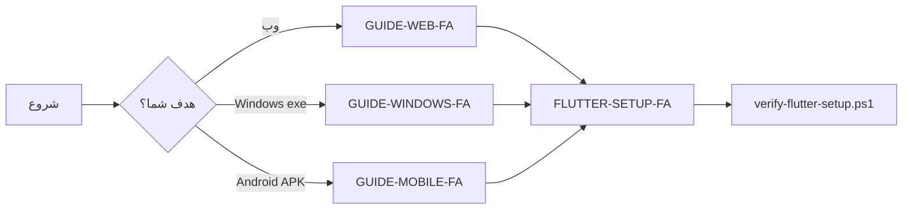

# مستندات calculator_app — از اینجا شروع کنید

> پروژه نمونه Flutter: ماشین‌حساب — **Web · Windows · Android 8.1+**  
> مسیر پروژه: `D:\0\calculator_app\calculator_app`  
> toolchain پیش‌فرض: `D:\Dev\` (Flutter · Android SDK · JDK · cache)

---

## کدام راهنما برای شماست؟

| نقش شما | راهنما | پیش‌نیاز اصلی |
|---------|--------|----------------|
| **توسعه‌دهنده وب** (Chrome، deploy استاتیک) | [GUIDE-WEB-FA.md](GUIDE-WEB-FA.md) | Flutter SDK + Chrome |
| **توسعه‌دهنده Windows** (exe دسکتاپ) | [GUIDE-WINDOWS-FA.md](GUIDE-WINDOWS-FA.md) | Flutter SDK + Visual Studio C++ |
| **توسعه‌دهنده موبایل** (APK، دستگاه، emulator) | [GUIDE-MOBILE-FA.md](GUIDE-MOBILE-FA.md) | Flutter SDK + Android SDK + NDK |
| **نصب toolchain در ایران** (آینه، SDK، Gradle) | [FLUTTER-SETUP-FA.md](FLUTTER-SETUP-FA.md) | PowerShell + (اختیاری) SOCKS |



---

## شروع سریع (همه نقش‌ها)

```powershell
cd D:\0\calculator_app\calculator_app

# نصب کامل (ارتقای خودکار stable، دانلود لایه‌ای)
powershell -ExecutionPolicy Bypass -File toolchain/scripts/install-full-toolchain-d-drive.ps1

# تست جامع + build واقعی
powershell -ExecutionPolicy Bypass -File toolchain/tests/Run-ToolchainTests.ps1 -IncludeNetwork -IncludeLiveVerify
powershell -ExecutionPolicy Bypass -File toolchain/scripts/run-production-builds.ps1

# آینه Pub (ایران)
$env:PUB_HOSTED_URL = "https://pub.myket.ir"
$env:FLUTTER_STORAGE_BASE_URL = "https://storage.flutter-io.cn"

flutter pub get
flutter test
flutter devices
```

| دستور | پلتفرم |
|--------|--------|
| `flutter run -d chrome` | Web |
| `flutter run -d windows` | Windows |
| `flutter run -d <android-id>` | Android |

---

## ساختار کد

| مسیر | توضیح |
|------|--------|
| `lib/main.dart` | UI ماشین‌حساب (Material 3) |
| `lib/calculator.dart` | منطق محاسبه (بدون وابستگی UI) |
| `test/` | تست واحد + smoke ویجت (۱۰ تست) |
| `web/` | `index.html`، PWA manifest |
| `windows/` | runner بومی Windows |
| `android/` | Gradle، minSdk 27، آینه Maven |
| `toolchain/` | اسکریپت نصب/verify ایران |

---

## چک سلامت toolchain

```powershell
powershell -ExecutionPolicy Bypass -File toolchain/scripts/verify-flutter-setup.ps1 -Strict -SkipDoctor
```

- **فقط Web:** `-Strict` اختیاری — Android SDK لازم نیست.
- **Windows release:** Visual Studio سبز در `flutter doctor`.
- **APK release:** `-Strict` اجباری (NDK + platform-36).

Verify همچنین چک می‌کند: اسکریپت‌ها، templates، docs، `minSdk 27`، آینه Gradle.

---

## فهرست کامل مستندات

1. [README-FA.md](README-FA.md) — این صفحه (نقطه ورود)
2. [GUIDE-WEB-FA.md](GUIDE-WEB-FA.md) — توسعه و deploy وب
3. [GUIDE-WINDOWS-FA.md](GUIDE-WINDOWS-FA.md) — توسعه و توزیع Windows
4. [GUIDE-MOBILE-FA.md](GUIDE-MOBILE-FA.md) — Android، emulator، APK
5. [FLUTTER-SETUP-FA.md](FLUTTER-SETUP-FA.md) — نصب toolchain ایران (عمیق)
